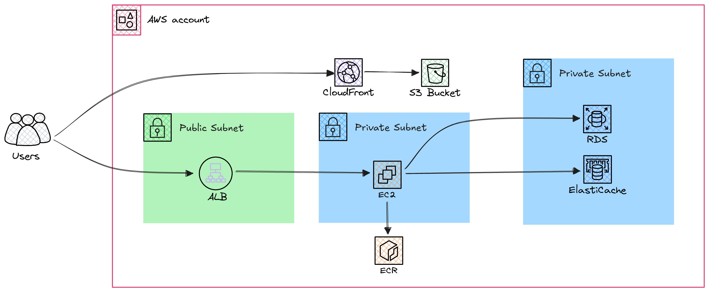

# Project Concept

This project focuses on developing a scalable platform for hosting a static website for an F1 Store. The backend handles user authentication, product management, and content delivery, while the frontend provides a clean and static interface for users. Additionally, caching mechanisms are employed to enhance performance, ensuring a seamless user experience.

# Project Overview

This project is structured into three primary components: backend services (RDS and Redis), and the frontend. Each component plays a critical role in delivering a comprehensive solution. Below is a summary of the key elements:

- **Backend (RDS)**: Built with a focus on scalability and reliability, managing relational database operations.
- **Backend (Redis)**: Optimized for session caching and quick access to frequently used data.
- **Frontend**: Designed to provide a responsive and static interface.

The platform utilizes PostgreSQL for database management and Redis for caching, ensuring optimal performance.

### Diagram


## File Structure

### 1. **Backend (RDS)**
- **Purpose**: Manages application logic and integrates with a relational database service.
- **Files**:
  - `manage.py`: Entry point for the backend application.
  - `requirements.txt`: Lists dependencies for the project.
  - `backend_rds/`: Contains the core backend logic, configuration files, and routes for the application.

### 2. **Backend (Redis)**
- **Purpose**: Handles backend logic with Redis for caching.
- **Files**:
  - `manage.py`: Entry point for the backend application.
  - `requirements.txt`: Lists dependencies for the project.
  - `backend_redis/`: Contains the core backend logic, configuration files, and routes for the application.

### 3. **Frontend**
- **Purpose**: Provides a static user interface.
- **Files**:
  - `index.html`: Main HTML file for the static frontend.
  - `style.css`: Stylesheet for frontend design.
  - `frontend/`: Contains static assets, configuration files, and additional frontend resources.

## Lifehacks

**Use ChatGPT everywhere**

**But don't ask it to write the code or solutions for you.**

Initially, use it to understand the diagram, all the interconnections on it, and why everything is arranged this way.

Next, use it when taking courses to find the information you need for the project's implementation. Use it here to deepen your understanding, create more examples and analogies. Break concepts into the simplest levels of abstraction and show maximum creativity when working with it.

Refer back to the course we took initially (about ChatGPT), recall the methods and strategies of prompts, and use them. Your main task is not just to implement the project but to learn how to break down new information into the simplest pieces with ChatGPT and build understanding as quickly as possible.

## Steps to Dockerize the Code

1. **Step 1: Cloning the Repository**

   Clone the repository to your local machine and navigate to the project directory:
   ```bash
   git clone https://github.com/THE-GAME-DEVOPS/f1-store.git
   cd f1-store
   ```

2. **Step 2: Writing Dockerfiles for Services**

   Write a `Dockerfile` for each service, including:
   - Backend RDS
   - Backend Redis

   Ensure each `Dockerfile` is properly configured to build and run its respective service.

3. **Step 3: Creating docker-compose.yml and Environment Variables**
   
   Write a `docker-compose.yml` file to define how the services interact and to simplify the orchestration process.

4. **Step 4: Building and Running Services**
   
   Build and start all services using Docker Compose with the `--build` option to rebuild images:
     ```bash
     docker-compose up -d --build
     ```

5. **Step 5: Monitoring Logs**
   
   To troubleshoot issues and monitor logs for each service:
   - View logs for all services:
     ```bash
     docker-compose logs -f
     ```
   - View logs for a specific service (e.g., backend-rds):
     ```bash
     docker-compose logs -f backend-rds
     ```
   - Stop monitoring logs by pressing `Ctrl+C`.

6. **Step 6: Stopping Services**
   
   To stop all running services:
   ```bash
   docker-compose down
   ```

## Deployment

**Important:** Do not modify the code. The code is written correctly, and your task is to deploy it to fulfill the project requirements. Therefore, there is no need to add or rewrite code as it is already functional.

### Backend Services
- Deploy the backend (backend_rds, backend_redis) services using EC2 as specified in the architecture diagram.

### Frontend
- Deploy the static frontend service using Amazon S3 and CloudFront as specified in the architecture diagram.

### Dockerization

- All services should be containerized using Docker to ensure ease of scaling and deployment.

### CI/CD Process

- Implement separate CI/CD pipelines for backend and frontend deployment to automate the process effectively.

